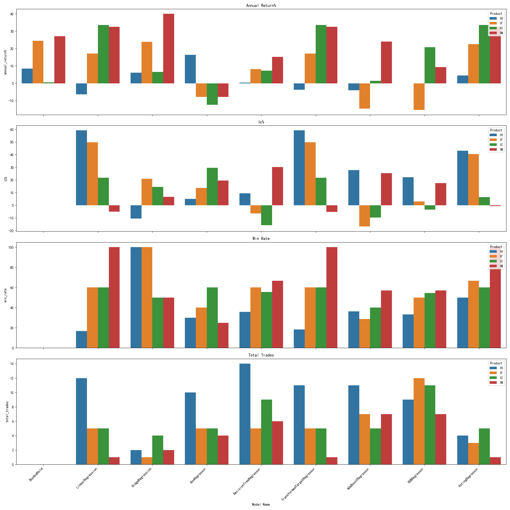
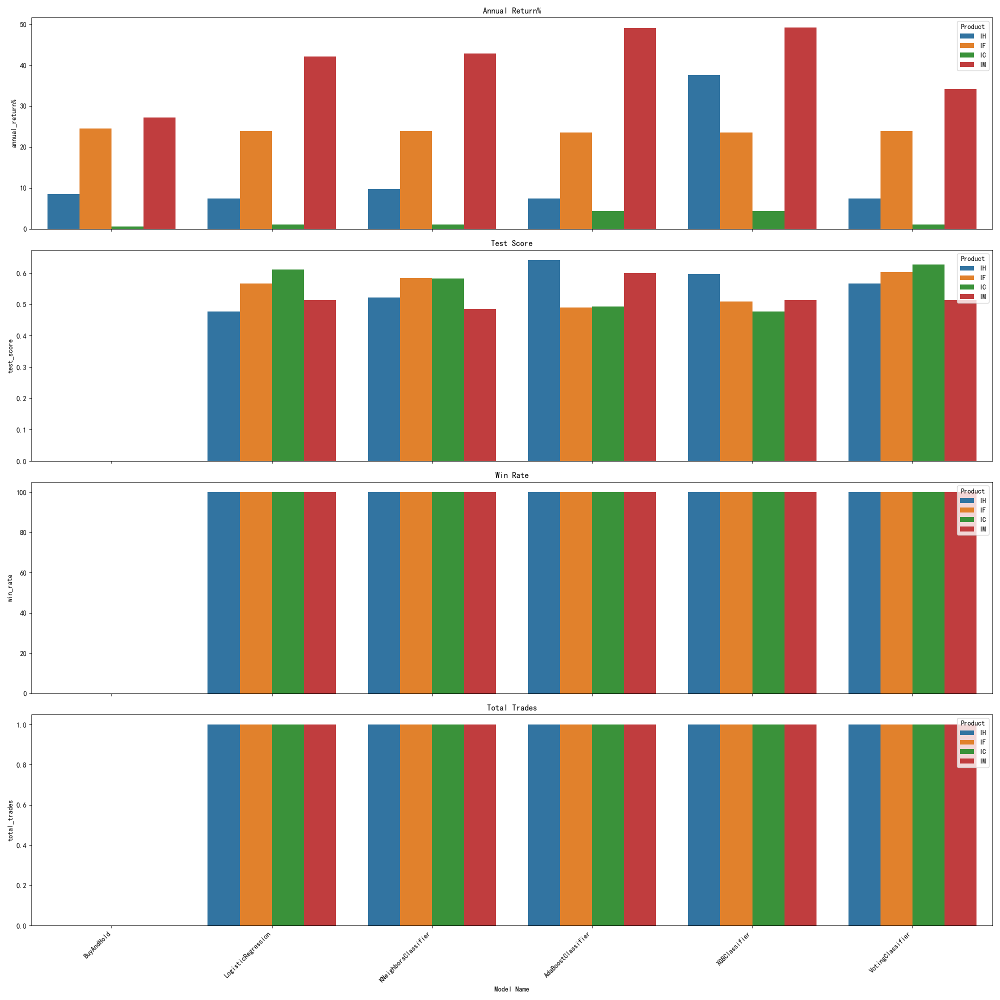

### Trading index ETFs by predictions from related index future contract trading info 

**Ming Lu**

#### Executive summary
* In the market studied in this report, both ETF and future contact can be traded for the same market index.
* This report outlines the development and evaluation of predictive models for market index ETF trading using related index futures contract trading info history and market index data history. Multiple machine learning models were trained to identify trading opportunities, with backtests conducted to assess profitability and risk. Top models showed consistent performance and robustness. The report details methodology, results, and recommendations for implementation.

#### Key finding
* Here is the key finding from this study:
    - High Information Coefficient (IC%) is observed between predicted return of index ETFs studied and real return of same ETF in unseen test dataset.  
    - Dramtic trading outcome improvement comes from trading of ETF 510500.SS using related trading info of future product IC:
        - Annual return from VotingRegressor prediction strategy  : **33.55%**
        - Annual return from buy and hold strategy **0.5%**
    - Trading with all 4 index ETFs basket with equal weight using VotingRegressor model:
        - Annual return from VotingRegressor prediction strategy  : **23.25%**
        - Annual return from buy and hold strategy **15.15%**


#### Rationale
* It's often said that futures traders are the "smart money." This study explores whether the public data of top 20 futures contract traders daily (across 7 categories, updated daily) can be leveraged to improve trading outcomes.
* The assumption that futures traders possess superior market insights underpins the inclusion of futures data, which may reveal predictive signals not fully reflected in ETF price movements. By integrating these datasets, the models aim to exploit correlations and patterns between ETF and futures market dynamics, enhancing the accuracy of trading strategies. Backtesting these models against historical data ensures their robustness, providing a data-driven foundation for profitable and risk-managed ETF trading.


#### Research Question
    * Can predictive models, trained on data below,leverage potential insights from futures traders to generate profitable and risk-adjusted trading strategies for the ETF?
        - Index ETF history
        - Index future contact history
        - Top 20 trading info for that index future contact in each categories, like trade volumn, buy volume, etc.


#### Data Sources
* **CSI Index Futures**: From [CFFEX](http://www.cffex.com.cn), including daily top 20 traders by volume and other metrics.
* **CSI Index Historical Data**: From Yahoo Finance.
* **Index ETF and related future product studied**:
    | Index Future Product | Index ETF   | Related market index         |
    |----------------------|-------------|------------------------------|
    | IH                   | 510050.SS   | CSI 50 index                 |
    | IF                   | 000300.SS   | CSI 300 index                |
    | IC                   | 510500.SS   | CSI 500 index                |
    | IM                   | 512100.SS   | CSI 1000 index               |

#### Source Data format
    * ** Index future contact top trader info **
        ```
        | Index Contact | trader    |   volume  | volchange   | buyvol  | buyvolchange  | sellvol   | sellvolchange| net_vol_diff   | datetime   |
        |---------------|-----------|-----------|-------------|---------|---------------|-----------|--------------|----------------|------------|
        | IC2001        | dealer1   |  15300    | 5392        | 5281    | 68331         | 100       | 75083        | 2008           |  20200102  |
        | IC2002        | delaer2   |  15288    | 5373        | 5268    | 2172          | 200       | 3898          | 592           |  20200102  |
        ```

    * ** Index future contact data **
        ```
            Index future contract data 
        | Contract | Open   | High   | Low    | Volume | Amount       | OpenInterest | OpenInterestChange | Close  | SettlementPrice | LastSettlementPrice | Change1 | Change2 | Delta | datetime  |
        |----------|--------|--------|--------|--------|--------------|--------------|--------------------|--------|-----------------|---------------------|---------|---------|-------|-----------|
        | IC2001   | 5300.0 | 5392.4 | 5281.0 | 68331  | 7312402.380  | 75083.0      | 2008.0             | 5361.8 | 5368.8          | 5266.8              | 95.0    | 102.0   | --    | 20200102  |
        | IC2002   | 5288.2 | 5373.6 | 5268.4 | 2172   | 231679.008   | 3898.0       | 592.0              | 5350.0 | 5359.2          | 5249.6              | 100.4   | 109.6   | --    | 20200102  |
        ```
    * ** Index ETF data **
        ```
        | Contract | Open   | High   | Low    | Close  | Volume       | datetime  |
        |----------|--------|--------|--------|--------|--------------|-----------|
        | IC2001   | 5300.0 | 5392.4 | 5281.0 | 68331  | 7312402.380  | 20200102  |
        | IC2002   | 5288.2 | 5373.6 | 5268.4 | 2172   | 231679.008   | 20200102  |
        ```

#### Methodology
    - This study developed predictive models for trading a market index ETF by integrating three primary datasets: 
        - Futures contract history data for the same market index 
        - Historical ETF history data for a market index. 
        - Trading info from top 20 traders in each category for the same market index

    - Trading info from Top 50 biggest traders by trading volume in history are used since their trading contributes **97.24%** of total future contact volume.

    - **Data preprocessing**:
        - Future contact trading info for top 50 traders based on historic total trading volume are reprocessed into one record per day even though only top 20 are reported each day in each of the 7 categories listed above.
            - 0 is used if no data is reported for that trader in that category.
        - Technical indicators like MACD, RSI are alo calculated.
        - There are 358 columns for each rowm, aka, each day by group data from different sources.
        - The percentage return of next day's close relatively to today's close is used target for training and evalution.
        - Here is a small subset of data columns:
            ```
            | Date       | Dealer1      | Dealer2           | Dealer n          | Index ETF    | Index future today  | Technical indicators |  CSI return (next day)    |
            |------------|--------------|-------------------|-------------------|--------------|---------------------|----------------------|---------------------------|
            | 2025-01-02 | 7 columns    |     7 columns     |     7 columns     |  5 columns   | 12 columns          |     many columns     |   -0.01                   |
            | 2025-01-03 | 7 columns    |     7 columns     |     7 columns     |  5 columns   | 12 columns          |     many columns     |   0.02                    |
            ```


    - ** Models studied**:
        - Regression models:
            - LinearRegression
            - RidgeRegression
            - KnnRegressor
            - DecisionTreeRegressor
            - TransformedTargetRegressor
            - AdaBoostRegressor
            - XGBRegressor
            - VotingRegressor:  using all regression models above
            - TensorFlow: Model training and evaluation only
                - Tensorflow MLP
                - Tensorflow RNN
                - Tensorflow LTSM
        - Classification models:
            - LogisticRegression
            - KNeighborsClassifier
            - AdaBoostClassifier
            - XGBClassifier
            - VotingClassifier: using all classfication models above
            - TensorFlow: Model training and evaluation only.
                - Tensorflow MLP
                - Tensorflow RNN
                - Tensorflow LTSM

    - **Model training**:
        - Test data setup: 
            -Data is split into 3 un-overlapped datasets to ensure no data polution and some models like Tensorflow RNN/LTSM requires un-overlapped data: 
                - First 85% of data used for training
                - Next 10% of data used for validation: This was intended to be used by tensorflow models.
                - Last 5% of data used for testing
        - Data collected for training and evalution:
            - Information Coefficient (IC%) for regression models between model prediction real target using test dataset.
            - MSE for regression models between model prediction real target using test dataset.
            - Test accuracy for classification models
    - **Back trade test** 
        - Backtrader setup:
            - Intial captial $100,000
            - 0.1% commission
            - Buy all when model prediction >0 or True
            - Sell all when model prediction <0 or False
            - Short trade is not allowed.
            - Buy and hold stratey is used as reference for the perod in the test dataset.
            - Closing price is used for all trades.

        - Data collected from Back trade tests:
            - Annual return in percent
            - Winning rate
            - Number of trades
            - Sharpe ation
            - Max draw down

Data preprocessing involved cleaning missing values, aligning timestamps between ETF and futures datasets, and engineering features such as price momentum, volatility, and ETF-futures price correlations. Multiple machine learning models, including regression, decision trees, and neural networks, were trained to predict ETF price movements and identify trading signals. Hyperparameter tuning was performed using cross-validation to optimize model performance.

Backtesting was conducted using historical data to simulate trading strategies derived from model predictions. Performance metrics, including annualized returns, Sharpe ratio, maximum drawdown, and win rate, were calculated to evaluate strategy effectiveness. Robustness was tested across different market conditions to ensure reliability. The methodology aimed to validate the hypothesis that combining ETF and futures data could yield profitable, risk-adjusted trading strategies.

#### Results
    - High Information Coefficient (IC%) is observed between predicted return of index ETFs studied and real return of same ETF in unseen test dataset.
        - This provides the basis for futher study the trade improvement by these model predictions.
    - Predictions from Regression models see trading outcome improvement overall  than buy and hold strategy.
    - Predictions from classification models seem to improve the trading outcome than buy and hold strategy. 
        - But the only 1 signal is triggered during 2 month test period. 
            - Question remains if this is accidental or indicates a trustworthy outcome.
            - More study is needed.
        - These models did avoid a sharp market drop during the test period.
    - Dramtic improvement comes from ETF related to future product IC which returns 33.55% vs 0.5% from buy and hold strategy
    - If VotingRegressor model is used with investment capital evenly splited into all 4 CSI index ETFs, the overall annual return will be 23.25% which is much better than the buy hold strategy return 15.15%
    # Index ETF Performance Comparison using voting model only:
    ```
    | Index Future Product | Index ETF   | Regression or Classification | Voting Model       | Annual Return from Prediction | Annual Return from Buy and Hold Strategy | Annual Return Improved by the Model  |
    |----------------------|-------------|-----------------------------|--------------------|-------------------------------|------------------------------------------|---------------------------------------|
    | IH                   | 510050.SS   | Regression                  | VotingRegressor    | 4.43%                         | 8.51%                                    | NO                                    |
    | IF                   | 000300.SS   | Regression                  | VotingRegressor    | 22.50%                        | 24.50%                                   | NO                                    |
    | IC                   | 510500.SS   | Regression                  | VotingRegressor    | 33.55%                        | 0.50%                                    | YES                                   |
    | IM                   | 512100.SS   | Regression                  | VotingRegressor    | 32.52%                        | 27.11%                                   | YES                                   |
    | IH                   | 510050.SS   | Classification              | VotingClassifier   | 7.42%                         | 8.51%                                    | NO                                    |
    | IF                   | 000300.SS   | Classification              | VotingClassifier   | 23.87%                        | 24.50%                                   | YES                                   |
    | IC                   | 510500.SS   | Classification              | VotingClassifier   | 0.99%                         | 0.50%                                    | YES                                   |
    | IM                   | 512100.SS   | Classification              | VotingClassifier   | 34.13%                        | 24.50%                                   | YES                                   |
    ```
    # Complete test result:
    - Test result for Regression based models: 

    - Test result for Classification based models: 


#### Next steps
    - More hyper-parameter searching, especially for tensorflow models
    - Back trade strategy tuning to reduce risk and improve stability

    - Pending issues:
        - Many efforts have been made to use Tensorflow based models, such as MLP, RNN, LTSM.
            - High Information Coefficient (IC%) between what these models predictions and test values in test set
            - High IC% did not translate good prediction for trades which is the goal of this project.

    - What to do next:
        - The tensorflow models may need to be fine-tune via hyperparameter optimization framework like KerasTuner, etc.
        - Trading strategy may need to be adjusted for tensorflow models.
    
    
#### Outline of project
    - [Data explore](https://github.com/mingl2000/UCBCapstone/blob/main/UCBCapstone_data_explorer.ipynb)
    - [Model train and test](https://github.com/mingl2000/UCBCapstone/blob/main/UCBCapstone_models.ipynb)
    - [Back trade testing](https://github.com/mingl2000/UCBCapstone/blob/main/UCBCapstone_backtest.ipynb)


#### project structure
    \---UCBCapstone
        |   app_settings.py                     * Applicaiton sttings for random seeds and plt
        |   README.md
        |   UCBCapstone_backtest.ipynb          
        |   UCBCapstone_backtest.py             * Code referenced by UCBCapstone_backtest.ipynb
        |   UCBCapstone_data_explorer.ipynb
        |   UCBCapstone_data_io.py              * Data input/output  
        |   UCBCapstone_data_prepare.py         * Data preprocessing phase 2
        |   UCBCapstone_data_view.py            * Data presentation: functions used by many plots in ipynb files
        |   UCBCapstone_models.ipynb            * 
        |   UCBCapstone_models.py               * Code referenced by UCBCapstone_models.ipynb.
        |   UCBCapstone_models_search.py        * Hyper-parameter search using GrdiSearchCV
        |
        +---data                                * All the data referenced by code above.
        | *.csv
        +---data_prepare
        |       future_preprocessing2.py        * Aata preprocessing from the data directly downloaded from cffex
        \---images                              * Images referenenced by this README.md
                backtrader_test_result.png
                classification_backtrader_test_result.png
                regression_backtrader_test_result.png
                Tensorflow_MLP_training.png

##### Contact and Further Information
Ming Lu

Email: ml124@cornell.edu 

[LinkedIn](https://www.linkedin.com/in/ming-lu-4187376)

