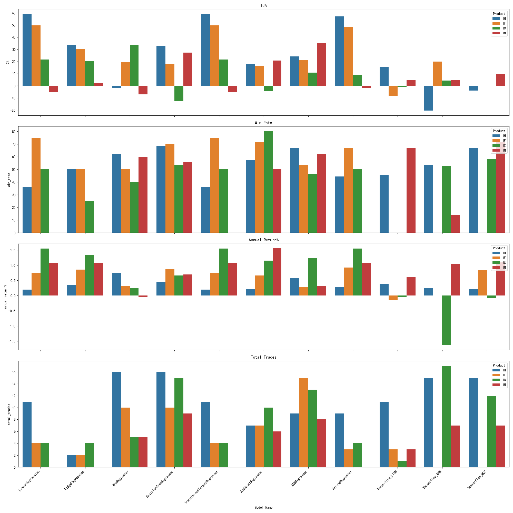

# UCB Capstone for AI/ML class

## Introduction

* It's often said that futures traders are the "smart money." This study explores whether the public data of top 20 futures contract traders daily (across 7 columns, updated daily) can be leveraged to improve trading outcomes.
* Specifically, we investigate if this data can enhance predictions of the CSI index performance.

## Jupyter Notebook

You can find the full Jupyter notebook for this study here:
👉 [data\_explore3.ipynb](https://github.com/mingl2000/UCBCapstone/blob/main/UCBCapstone.ipynb)

## Data Sources

* **CSI 300 Index Futures**: From [CFFEX](http://www.cffex.com.cn), including daily top 20 traders by volume and other metrics.
* **CSI 300 Index Historical Data**: From Yahoo Finance.

## Data Preprocessing
* Index future data 
  | Contract | Open   | High   | Low    | Volume | Amount       | OpenInterest | OpenInterestChange | Close  | SettlementPrice | LastSettlementPrice | Change1 | Change2 | Delta | datetime  |
  |----------|--------|--------|--------|--------|--------------|--------------|--------------------|--------|-----------------|---------------------|---------|---------|-------|-----------|
  | IC2001   | 5300.0 | 5392.4 | 5281.0 | 68331  | 7312402.380  | 75083.0      | 2008.0             | 5361.8 | 5368.8          | 5266.8              | 95.0    | 102.0   | --    | 20200102  |
  | IC2002   | 5288.2 | 5373.6 | 5268.4 | 2172   | 231679.008   | 3898.0       | 592.0              | 5350.0 | 5359.2          | 5249.6              | 100.4   | 109.6   | --    | 20200102  |


* Futures data from **January 4, 2021** onwards was collected.
* **Top 50 dealers** were selected based on total trading volume over the entire period.
  * Each day's net long/short positions for these 50 dealers were organized into a single row. If a dealer has no data for a specific day, a value of 0 was used.
  * The futures data was merged with the CSI index daily return data to form a dataset like:

  ```
  | Date       | Dealer1 | Dealer2 | Dealer3 | CSI return (next day) |
  |------------|---------|---------|---------|------------------------|
  | 2025-01-02 |  -100   |   80    |  -70    |         -0.01         |
  | 2025-01-03 |   200   |  -100   |   70    |         -0.02         |
  ```

## Dealer Analysis

* Top 50 dealers account for over **97%** of the total trading volume.
* Top 100 dealers account for over **99%**.
* Therefore, the **top 50 dealers** are used for all further analysis.

## Information Coefficient (IC) Analysis

The **Information Coefficient** between futures contract trading data and next-day CSI index returns are analyzed in addition to RMSE.

* **Per data column (aggregated across dealers):**

  * `volume`: End-of-day contract volume
  * `volchange`: Daily change in contract volume
  * `buyvol`: End-of-day buy contract volume
  * `buyvolchange`: Daily change in buy contract volume
  * `sellvol`: End-of-day sell contract volume
  * `sellvolchange`: Daily change in sell contract volume
  * `net_vol_diff`: `buyvolchange - sellvolchange`

* **Per dealer:**

  * The two largest dealers showed IC ≈ **0.1**
  * One smaller dealer had an IC ≈ **0.3**, but their data was not consistently available and their trading volume was small.


### IC from Model Predictions vs. Actual CSI Index Return % (Next Day)

* **Following models are tried and compared** and **LinearRegression** is used as **baseline model**.
  - LinearRegression
  - KnnRegressor
  - DecisionTreeRegressor
  - SupportVectorRegressor
  - TransformedTargetRegressor
  - AdoBoost
  - XgbBoost
  - VotingRegressor using the following models:
    - LinearRegression
    - KnnRegressor
    - DecisionTreeRegressor
    - TransformedTargetRegressor
    - AdoBoost
    - XgbBoost
  - TensorFlow
    - Tensorflow MLP
    - Tensorflow RNN
    - Tensorflow LTSM


  * IC%  from  VotingRegressor is consitently higher than most of models for all future products studied.
  * Grid-searched model achieves similar IC

* **Test result**:
  Here is the test summary across multiple models and mutliple csi index future products.
    - For some index future products, such as IC, the Information Coefficient% seem to be higher acoss models. 
    - Please notem the **Information Coefficient% is 100 times of Information Coefficient**.
    - Generally speaking, the RMSE is fairely consistent between models and across products with exception XgbBoost for IM.
      - More turning for XgbBoost may be needed.
    - Surprising, test resul from Tensorflow models (MLP, RNN, LTSM) is not as good as non-tensorflow models.
    - While VotingRegressor returns high IC% for future product IH/IF, but this did lead to higher winner rate nor annual return.
    - Predicted data from SupportVectorRegressor model is constance for some future products. This is excluded for this backtrade test in this report.

* **Backtrader Test setup**:
  - The dataset prepared for each product is split into 3 datasets by date:
    - First 85% of data used for training
    - Next 10% of data used for validation
    - Last 5% of data used for testing
  - This dataset split ensures same datasets are used by all models.
    - Tensorflow RNN/LTSM requires data for slide time window. Randomized split data leads to data pollution. 

* **Backtrader Test Summary**:
  - Information Coefficient% is very high many models for future product IH/IF
  - Winning rate for those back tests with high Information Coefficient% is high as well
  - The annualized return is lower than risk free interest rate. This may be due to the total number trades triggered is low and return of each trades is low as well due to the nature of index.
  - Please see the following chart for details:
  

* ** Feature engineering**
  - MACD, RSI, MA stock indicators are added to the input data
  - Test shows that RSI indicator is listed as top 10 important features for some models. 

# Backtrader Test Result:
  Here is the back trader tests from the UCBCapstone.ipynb notebook:

| Index | Prodct Type | Model                     |  Information Coefficient% | MSE | Annual Return% | win rate% | total trades | Sharpe Ratio | Max Drawdown |Index ETF | Index Name      |
|-------|------------|----------------------------|-------------|--------------|------------|-----------|-----------|-----------|-----------|-----------|-----------------|
| 0     | IH         | LinearRegression           | 59.137167   | 4.425738e-05 | 0.197144   | 36.363636 |  11       | 0.033510  | 1.226869  | 510050.SS | CSI 50 Index    |
| 1     | IH         | RidgeRegression            | 33.335994   | 1.405721e-04 | 0.360843   | 50.000000 |   2       | 0.096074  | 0.883643  | 510050.SS | CSI 50 Index    |
| 2     | IH         | KnnRegressor               | -1.963562   | 9.371028e-05 | 0.748552   | 62.500000 |  16       | 0.095910  | 3.468588  | 510050.SS | CSI 50 Index    |
| 3     | IH         | DecisionTreeRegressor      | 32.675226   | 8.701422e-05 | 0.464293   | 68.750000 |  16       | 0.044037  | 5.168186  | 510050.SS | CSI 50 Index    |
| 4     | IH         | TransformedTargetRegressor | 59.137167   | 4.425715e-05 | 0.197144   | 36.363636 |  11       | 0.033510  | 1.226869  | 510050.SS | CSI 50 Index    |
| 5     | IH         | AdaBoostRegressor          | 17.694659   | 6.535469e-05 | 0.226666   | 57.142857 |   7       | 0.026012  | 2.731649  | 510050.SS | CSI 50 Index    |
| 6     | IH         | XGBRegressor               | 24.121004   | 6.213977e-05 | 0.589273   | 66.666667 |   9       | 0.093805  | 2.313842  | 510050.SS | CSI 50 Index    |
| 7     | IH         | VotingRegressor            | 57.081853   | 5.310142e-05 | 0.273751   | 44.444444 |   9       | 0.059235  | 1.285824  | 510050.SS | CSI 50 Index    |
| 8     | IH         | Tensorflow_LTSM            | 15.495255   | 9.825646e-01 | 0.394444   | 45.454545 |  11       | 0.078956  | 1.227821  | 510050.SS | CSI 50 Index    |
| 9     | IH         | Tensorflow_RNN             | -20.479094  | 1.305353e+17 | 0.251014   | 53.333333 |  15       | 0.029246  | 2.466315  | 510050.SS | CSI 50 Index    |
| 10    | IH         | Tensorflow_MLP             | -3.859447   | 9.996649e-01 | 0.224131   | 66.666667 |  15       | 0.028746  | 2.935605  | 510050.SS | CSI 50 Index    |
| 11    | IF         | LinearRegression           | 49.693598   | 4.343613e-03 | 0.753148   | 75.000000 |   4       | 0.150751  | 2.384734  | 000300.SS | CSI 300 Index   |
| 12    | IF         | RidgeRegression            | 30.358007   | 1.910503e-03 | 0.855003   | 50.000000 |   2       | 0.164998  | 2.552258  | 000300.SS | CSI 300 Index   |
| 13    | IF         | KnnRegressor               | 19.724497   | 2.886102e-05 | 0.311076   | 50.000000 |  10       | 0.062223  | 2.321840  | 000300.SS | CSI 300 Index   |
| 14    | IF         | DecisionTreeRegressor      | 18.047211   | 1.021990e-04 | 0.867911   | 70.000000 |  10       | 0.206255  | 1.606757  | 000300.SS | CSI 300 Index   |
| 15    | IF         | TransformedTargetRegressor | 49.693598   | 4.343613e-03 | 0.753148   | 75.000000 |   4       | 0.150751  | 2.384734  | 000300.SS | CSI 300 Index   |
| 16    | IF         | AdaBoostRegressor          | 16.406959   | 2.962083e-05 | 0.667080   | 71.428571 |   7       | 0.140703  | 2.492903  | 000300.SS | CSI 300 Index   |
| 17    | IF         | XGBRegressor               | 21.222383   | 3.766896e-05 | 0.277141   | 53.333333 |  15       | 0.084420  | 2.191233  | 000300.SS | CSI 300 Index   |
| 18    | IF         | VotingRegressor            | 48.113208   | 6.090753e-04 | 0.924789   | 66.666667 |   3       | 0.179109  | 2.542569  | 000300.SS | CSI 300 Index   |
| 19    | IF         | Tensorflow_LTSM            | -8.420187   | 9.615476e-01 | -0.159094  | 0.000000  |   3       | -0.254451 | 0.871513  | 000300.SS | CSI 300 Index   |
| 20    | IF         | Tensorflow_RNN             | 19.867347   | 2.716819e+17 | 0.000000   | 0.000000  |   0       | 0.000000  | 0.000000  | 000300.SS | CSI 300 Index   |
| 21    | IF         | Tensorflow_MLP             | 0.000000    | 9.981915e-01 | 0.829341   | 0.000000  |   0       | 0.159451  | 2.555831  | 000300.SS | CSI 300 Index   |
| 22    | IC         | LinearRegression           | 21.653763   | 1.672055e-02 | 1.547383   | 50.000000 |   4       | 0.190986  | 2.384553  | 510500.SS | CSI 500 Index   |
| 23    | IC         | RidgeRegression            | 20.057467   | 1.708738e-02 | 1.334198   | 25.000000 |   4       | 0.160575  | 2.384433  | 510500.SS | CSI 500 Index   |
| 24    | IC         | KnnRegressor               | 33.520256   | 7.845432e-04 | 0.260774   | 40.000000 |   5       | 0.019087  | 6.664658  | 510500.SS | CSI 500 Index   |
| 25    | IC         | DecisionTreeRegressor      | -12.448830  | 6.423623e-03 | 0.667194   | 53.333333 |  15       | 0.107556  | 2.201611  | 510500.SS | CSI 500 Index   |
| 26    | IC         | TransformedTargetRegressor | 21.653763   | 1.672057e-02 | 1.547383   | 50.000000 |   4       | 0.190986  | 2.384553  | 510500.SS | CSI 500 Index   |
| 27    | IC         | AdaBoostRegressor          | -4.583853   | 1.999040e-04 | 1.150653   | 80.000000 |  10       | 0.193698  | 1.427381  | 510500.SS | CSI 500 Index   |
| 28    | IC         | XGBRegressor               | 10.798946   | 1.293296e-03 | 1.242938   | 46.153846 |  13       | 0.165989  | 3.747380  | 510500.SS | CSI 500 Index   |
| 29    | IC         | VotingRegressor            | 8.791603    | 4.739916e-03 | 1.547383   | 50.000000 |   4       | 0.190986  | 2.384553  | 510500.SS | CSI 500 Index   |
| 30    | IC         | Tensorflow_LTSM            | -0.698408   | 1.000007e+00 | -0.055332  | 0.000000  |   1       | -0.256312 | 0.388213  | 510500.SS | CSI 500 Index   |
| 31    | IC         | Tensorflow_RNN             | 4.233871    | 5.744177e+15 | -1.632252  | 52.941176 |  17       | -0.116445 | 10.678757 | 510500.SS | CSI 500 Index   |
| 32    | IC         | Tensorflow_MLP             | -0.402552   | 9.991668e-01 | -0.089513  | 58.333333 |  12       | -0.025759 | 3.890411  | 510500.SS | CSI 500 Index   |
| 33    | IM         | LinearRegression           | -5.098039   | 1.326792e-01 | 1.086045   | 0.000000  |   0       | 0.102405  | 3.075232  | 512100.SS | CSI 1000 Index  |
| 34    | IM         | RidgeRegression            | 1.932773    | 5.585410e-02 | 1.086045   | 0.000000  |   0       | 0.102405  | 3.075232  | 512100.SS | CSI 1000 Index  |
| 35    | IM         | KnnRegressor               | -7.198880   | 1.292775e-04 | -0.059585  | 60.000000 |   5       | -0.058728 | 0.893274  | 512100.SS | CSI 1000 Index  |
| 36    | IM         | DecisionTreeRegressor      | 27.227502   | 3.635647e-04 | 0.701394   | 55.555556 |   9       | 0.093503  | 3.039058  | 512100.SS | CSI 1000 Index  |
| 37    | IM         | TransformedTargetRegressor | -5.182073   | 1.321083e-01 | 1.086045   | 0.000000  |   0       | 0.102405  | 3.075232  | 512100.SS | CSI 1000 Index  |
| 38    | IM         | AdaBoostRegressor          | 20.704191   | 8.577275e-05 | 1.557022   | 50.000000 |   6       | 0.166713  | 3.331721  | 512100.SS | CSI 1000 Index  |
| 39    | IM         | XGBRegressor               | 35.406162   | 1.132003e-04 | 0.316588   | 62.500000 |   8       | 0.038290  | 3.039029  | 512100.SS | CSI 1000 Index  |
| 40    | IM         | VotingRegressor            | -1.792717   | 1.857259e-02 | 1.086045   | 0.000000  |   0       | 0.102405  | 3.075232  | 512100.SS | CSI 1000 Index  |
| 41    | IM         | Tensorflow_LTSM            | 4.516129    | 3.976535e-04 | 0.617827   | 66.666667 |   3       | 0.079340  | 2.822961  | 512100.SS | CSI 1000 Index  |
| 42    | IM         | Tensorflow_RNN             | 4.919355    | 1.144205e-01 | 1.053215   | 14.285714 |   7       | 0.140898  | 2.895634  | 512100.SS | CSI 1000 Index  |
| 43    | IM         | Tensorflow_MLP             | 9.580503    | 6.510453e-03 | 1.098851   | 71.428571 |   7       | 0.209346  | 1.542261  | 512100.SS | CSI 1000 Index  |


* **Insights from backtrade test result**:
  * **LinearRegression** does not offer best RMSE in general across all products.
    - But for some products, like **IH/IF**, information coefficient from LinearRegression is very impressive to be more than 0.49 or 49% reported above.

  * **Tensorflow** model:
    - It seems to be strange that the mighty Tensorflow did not offer best RMSE nor information coefficient:
      - The data may be linear by nature.
      - The Tensorflow model may be too complicated.
      - Different Tensorflow model may be needed where Keras turning may help.

  * For index future product **IC**, the information coefficient is consistently high across most of models, except KnnRegressor and Tensorflow
    - This indicates that there is a strong correlation between the CSI index change next day and this future product trading info.
    - This product may offer best insight for CSI index trading. 

  * **IH**,**IF** and **IM** futures show less predictive power for their corresponding ETF returns.
    - When Information Coefficient (IC) is **positive**, when prediction is **positive**, **positive** return next day is expected. 


### Try with AdaBoostRegressor for all CSI future index products
    - Information Coefficient (IC) for product IC got -0.22 which is much more significent than the 0.02 from Regressor

## Study Conclusions

* While high Information Coefficient% and high winner rate in back trade testing for IH/IF future product, but the annual return is lower than expected.
  * This may be due to the following:
    - The market is generally calm or downward in the testing period
    - The stock exchange only offers long trades.
    - Big gap in time between training data and test data. The market in testing period may have changes not visible during the traing period 
    - The number of trades triggered is low due to the combination of the 3 above. 
* Due to higher winner rate than 50% for future product IH and IF studied, the prediction from models studied such as VotingRegressor may be used to time the market when trading securities in the market sector crosponding to the market indexes


*

## Future Work
  - Use the important features found from LinearRegression for train and test


